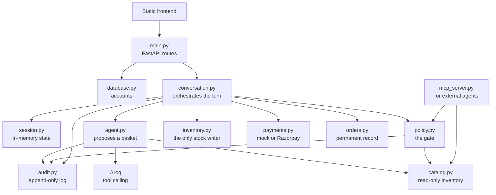
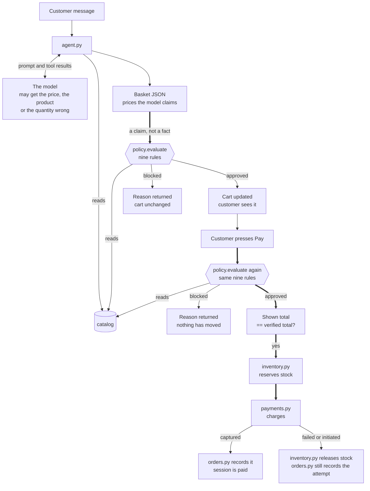
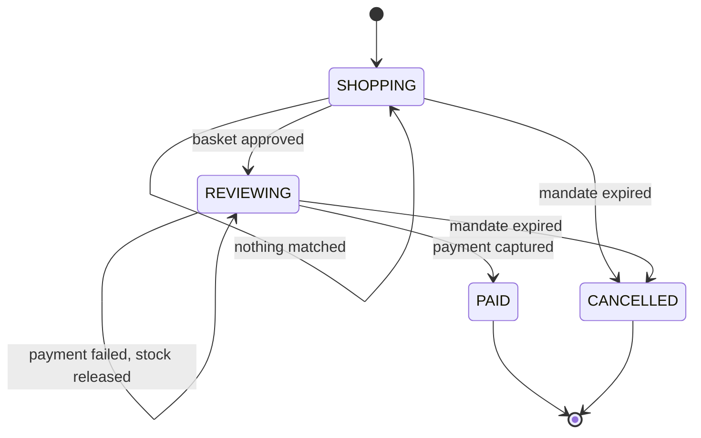
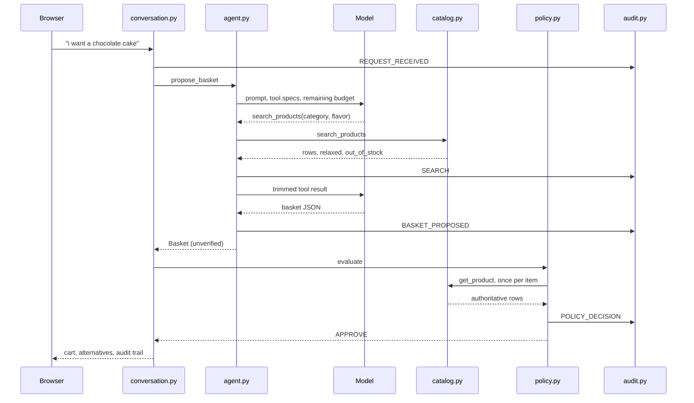
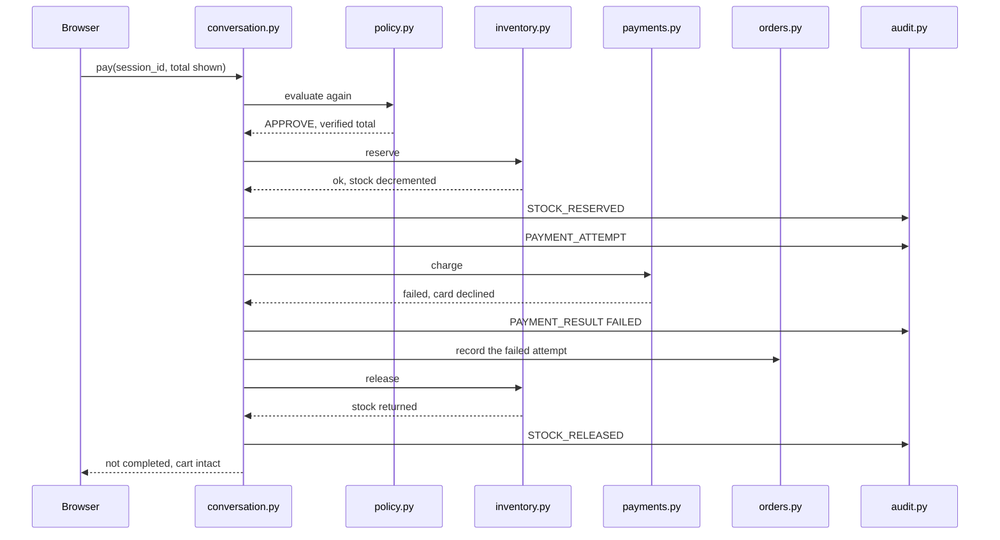
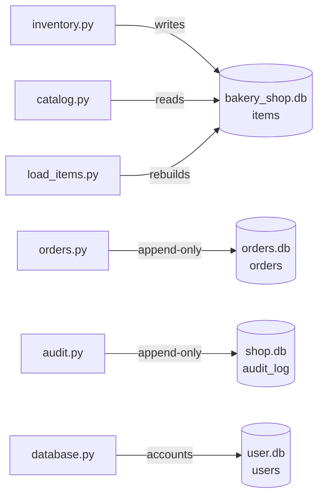
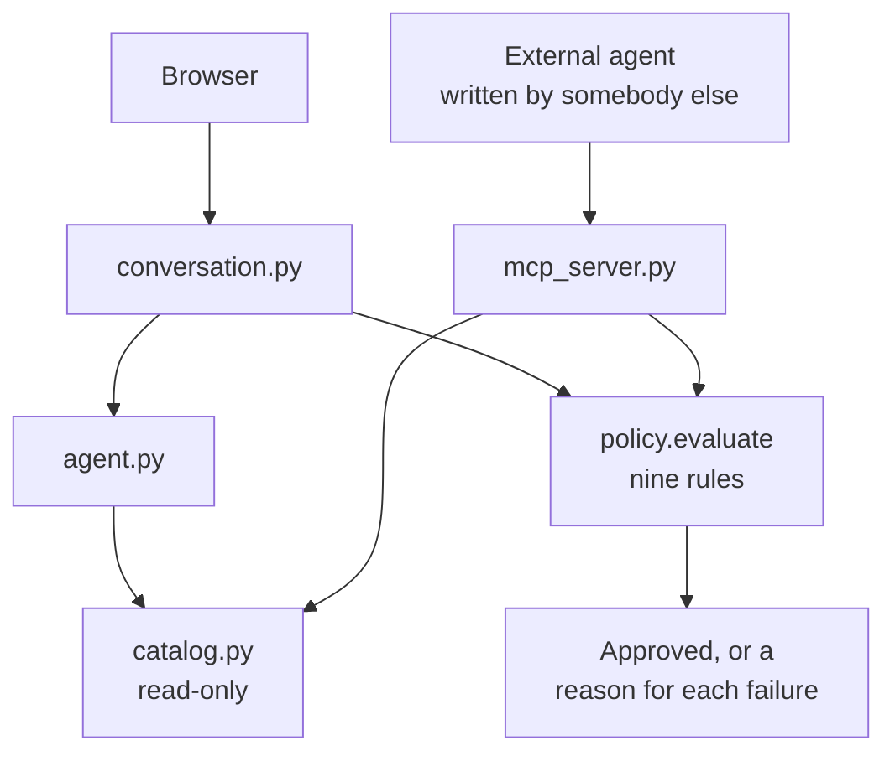

# Agentic Bakery Storefront — Architecture

**Razorpay AI Buildathon · Track 01 — AI growth and agentic commerce**

---

## 1. The problem this project is trying to solve

Think about the last thing you bought online. Just before paying, you
probably checked the total one more time — was the price correct, was
the item actually what you wanted, and was the amount still within what
you were willing to spend?

It is a small step, but it is also the last point where a mistake can be
caught before money moves.

Now imagine removing that step and letting an AI agent handle the
purchase.

An agent can confidently say a cake costs ₹500 when the catalog says
₹550. It can select a product that does not exist, request more units
than are in stock, or build a basket that goes beyond the customer's
authorised budget. The problem is not necessarily that the model is
badly prompted. An LLM generates a proposed action based on what it
believes to be true — and that belief can be wrong.

For a normal chatbot, a wrong answer is usually just a wrong answer. For
an agent connected to inventory and payments, the same mistake can
become an irreversible action.

That is why this project treats the agent's output as a **claim**, not
as the source of truth.

The agent is allowed to search the catalog and propose a basket, but it
does not get to decide whether that basket is valid. Before anything
consequential happens, a deterministic policy layer checks the proposal
against the actual system state.

That leaves three important questions outside the LLM's judgement.

### Who authorised the spending?

Every session has a mandate that defines how much the agent is allowed
to spend. The limit is established before the agent starts making
decisions and is stored outside the agent's control. The agent can
propose products within that limit, but it cannot change the mandate
simply by being asked to.

### What verifies that the proposal is actually correct?

The system does not rely on the model to remember prices, stock levels
or product details correctly. The catalog and inventory are treated as
authoritative. The policy layer re-checks product identity, current
price, quantity, stock availability, budget and the other transaction
constraints before allowing the purchase to proceed.

The model proposes and the system verifies.

### What happens when something goes wrong?

An agent log tells us what the agent attempted to do. That is not
enough. The system also records the authorisation and the policy
decisions around the transaction — what the agent proposed, what was
verified, which checks passed or failed, and what ultimately happened to
the payment.

That gives the merchant a traceable record of the decision, rather than
simply a history of model messages.

### Why a bakery

The demo is a bakery because it makes the idea easy to understand: you
can ask for a cake in a normal sentence and let the agent search the
catalog and build a basket.

But the bakery is not really the point. The interesting part is the
boundary between what an AI agent proposes and what the system is
actually willing to allow.

The LLM handles the flexible part — understanding language, searching,
making suggestions. The deterministic parts handle the consequences —
authorisation, validation, inventory, payment state and auditability.

That separation is the core of the project.

---

## 2. Module map



| Module | What it is responsible for | What it writes to |
|---|---|---|
| `main.py` | HTTP routes and request models | — |
| `conversation.py` | One message in, one reply out | session state |
| `session.py` | Session objects and their states | memory |
| `agent.py` | Turning language into a proposed basket | — |
| `catalog.py` | Inventory search and enum generation | — |
| `policy.py` | Verifying every basket | audit log |
| `inventory.py` | Reserving and releasing stock | `bakery_shop.db` |
| `payments.py` | Talking to a payment provider | — |
| `orders.py` | One row per payment attempt | `orders.db` |
| `audit.py` | The append-only decision log | `shop.db` |
| `mcp_server.py` | Exposing the shop to outside agents | — |
| `database.py` | User accounts (only for registration) | `user.db` |
| `model.py` | `Basket`, `BasketItem`, `Mandate` | — |

Almost every request goes through `conversation.py`. The modules it
calls do not call each other — `agent.py` has never heard of
`policy.py`, and `inventory.py` has never heard of `payments.py`. All
the coordination sits in one file, which means you can read the whole
purchase flow top to bottom without jumping between modules.

Three things write to the audit log: `agent.py` records what it
searched and what it proposed, `policy.py` records what it decided, and
`conversation.py` records the request and everything that happens around
the payment.

---

## 3. The Flow Chart

The rest of the project builds on this decision, so it deserves careful
consideration.



Reading it from the top: a customer message goes to `agent.py`, which
talks to the model and reads the catalog to answer it. What comes back
is a basket with prices in it — and those prices are whatever the model
produced. At that point nobody has checked them.

That is why the arrow into the gate is labelled *a claim, not a fact*.
Everything above that line is something the model said. Everything below
it is permanent: stock moves, money moves, a row gets written.

Three things in the diagram are worth pointing out.

**The catalog is read three times.** Once by `agent.py` to build the
basket, then again by each run of the gate. That looks wasteful and is
deliberate — reading it once would mean trusting the agent's copy of the
price, which is the one thing this design will not do.

**The gate runs twice, not once.** The first run happens when the basket
is built, so a customer never sees a cart that could not be paid for.
The second happens the moment Pay is pressed, because that first
approval might be a minute old and stock or prices can move in a minute.
The second run is also where the total the browser is displaying is
compared against the total the shop works out right then. If they have
drifted apart, everything stops before any stock is held.

**Nothing moves until Pay.** Adding to a cart touches only session
memory. `inventory.reserve()` lives inside `pay()` and nowhere else,
which is why two customers can both hold the last cake in their carts —
and why only one of them can buy it.

What keeps this honest in practice is what `agent.py` does not import.
There is no reference to `policy.py`, `inventory.py` or `payments.py`
anywhere in that file. The agent has no route to stock or money.

There is a cost, and it should be said plainly: every price gets read
from the database twice. Once so the agent can assemble a basket, and
once so the gate can verify it. That duplication is the point. Reading
it once would mean trusting the agent's copy, which is the one thing
this design will not do.

---

## 4. Session state machine



Four states, all defined in `session.py`.

Most of the interesting behaviour lives in the transitions that loop
back to the same state. A blocked change, a cleared cart and a failed
payment all leave the session in `REVIEWING`, but each one does
something different and each one is logged separately.

`PAID` is terminal. If a second pay request arrives on a session that
has already paid, it is refused before any provider is contacted.
`CANCELLED` can be reached from either working state, and the expiry
check runs at the top of every single turn — so letting a conversation
stay open is not a way around an expired mandate.

---

## 5. What happens when someone adds to their cart



The model picks the search itself rather than the code guessing on its
behalf. The loop in `agent.py` allows up to three rounds, so a customer
asking for two different things gets two separate searches instead of
one blurred query that matches neither of them properly.

Tool results are trimmed before they go back — nine fields, not the
whole row. Product descriptions are long and the model does not need
them to choose an item. That change cut tokens per request by roughly
two thirds, which started to matter once rate limits came into it.

And `policy.py` calls `catalog.get_product()` again for every item, even
though `agent.py` read the same rows a second earlier. That is not a
wasted query. That is the verification.

---

## 6. What happens when a payment succeeds


The gate runs a second time here, and the reason matters. The basket was
approved when it was built, but stock and prices can get updated or
changed in between.

The browser also sends back the total it was displaying, and that number
is compared against what the shop works out right now. If they are not
the same, the payment stops before anything is reserved. A customer
should never end up confirming one amount while a different one gets
charged.

---

## 7. What happens when a payment fails



Stock gets reserved before the charge, never after. If it were the other
way round, another session could take the last item in the gap between
charging and reserving, and the customer would have paid for something
that no longer exists. With this ordering the worst normal outcome is
"your payment didn't go through", and the reservation simply goes back.

The failed attempt is still written to `orders.db` — `orders.record()`
runs before the outcome is checked, so an attempt that never became a
payment is recorded exactly like one that did. The audit log in
`shop.db` separately captures the `PAYMENT_RESULT` and `STOCK_RELEASED`
events around it. When a dispute comes in, the question is what was
attempted, not only what worked.

The session stays in `REVIEWING` with the cart intact, so retrying is
one click.

---

## 8. Payment outcomes

| Status | Meaning | Stock | Session becomes |
|---|---|---|---|
| `captured` | Money moved | Stays reserved | `PAID` |
| `initiated` | Razorpay order created, checkout not completed | Released | stays `REVIEWING` |
| `failed` | Declined, or a provider error | Released | stays `REVIEWING` |

The middle one exists because creating a Razorpay order and receiving a
payment are not the same event. `order.create` produces an order. The
money has not moved until the customer finishes checkout.

Calling that a success would have made for a smoother demo, but it would
put something in the audit log that isn't true — which is the exact
failure this project is about. So it reports what actually happened.

Razorpay credentials are generated from the dashboard and stored as
environment variables. The provider itself is selected the same way:

```python
PROVIDERS = {"mock": _mock, "razorpay": _razorpay}
```

---

## 9. The gate

`policy.RULES` is a list of nine independent functions. Each one gets
the basket, the mandate and the catalog rows, and hands back a list of
reasons why it is unhappy. An empty list means that rule is satisfied.

`evaluate()` runs all nine and gathers everything they return rather
than stopping at the first failure. That is deliberate. If a basket has
three things wrong with it, the customer should see all three at once.

| Rule | Blocks when |
|---|---|
| `_mandate_valid` | The authorisation has expired |
| `_basket_not_empty` | There is nothing to pay for |
| `_no_duplicates` | The same product appears more than once |
| `_products_exist` | A product ID is not present in the catalog |
| `_prices_match` | The claimed price differs from the real price by more than ₹0.01 |
| `_quantities_sane` | Quantity is below 1 |
| `_stock_sufficient` | Requested quantity exceeds available stock |
| `_within_total_budget` | Basket total exceeds the mandate budget |
| `_velocity_ok` | Three or more orders were captured in the last ten minutes |

More rules can be added easily — write a function and append it to the
list.

**`_no_duplicates`** seems cosmetic — who cares if the same cake shows
up twice in a list? But this basket was put together by an agent, not a
person, and stock is checked one line at a time. If there are three
cakes left and the agent sends two lines of two units each, both lines
pass the stock check on their own while the basket as a whole needs
four.

**`_products_exist`** is the anti-hallucination rule, and it also
protects the ones after it. `_prices_match` and `_stock_sufficient` both
skip items they cannot find in the catalog, so without this rule an
invented product would sail past every price and stock check and only
fall over at reservation time.

**`_velocity_ok`** is the only rule that looks at the audit log instead
of the basket. The others ask whether this basket is valid. This one
asks whether the customer is buying at a human speed. A runaway agent
produces orders that are each individually perfect — real products,
correct prices, enough stock, inside the budget — so no amount of
per-basket checking finds it. Only the pattern across orders does.

One note on `_prices_match`: it compares against `final_price`, the
discounted price, which is worked out in exactly one place and read by
both the agent and the gate.

### When the gate actually fires

In ordinary use the gate approves nearly everything. The agent is given
the remaining budget in its prompt, and its search ceiling is capped at
that same number, so it rarely proposes something it cannot afford. Ask
for a cake that would break the budget and the agent usually refuses on
its own, before the gate is even reached — the audit trail for that turn
shows a `BASKET_PROPOSED` with no `POLICY_DECISION` after it.

That is good product behaviour. The customer gets an answer in one turn
instead of watching a basket get built and then rejected.

But it is the model's judgement, not enforcement, and the two are not
interchangeable. The gate exists for the cases the model cannot help
with, and there are two of them.

The first is a request that did not come from this agent at all. Over
MCP the model is not in the loop, so nothing filters the request before
it arrives — section 13.

The second is a race. Two customers can both have the last cake in their
basket, both approved, because the stock was there when each basket was
built. The model has no way of knowing somebody else took it a second
later. Only a check at payment time catches that, and it does: the
second customer is refused with the real stock number, before the
gateway is contacted.

---

## 10. The mandate

Fixed when the session opens, and fixed for its lifetime:

```python
@dataclass
class Mandate:
    mandate_id: str
    customer_id: str
    expires_at: datetime
    total_budget: float
```

The agent is told the budget and how much of it is already committed, so
it rarely proposes anything over the limit to begin with. The gate
enforces it, so it cannot succeed if it tries.

There is no override anywhere. A basket over budget does not get added,
and if one somehow reaches checkout the gate stops it before stock is
held or a provider is called. Changing a budget means starting a new
session with a new mandate — which is on purpose. Every order row stores
the `mandate_id` it was placed under.

For now, every purchase is confirmed by a person, so the budget
constraint acts as an additional safeguard. The mandate becomes critical
in the fully autonomous case this architecture is designed for: when an
agent can make purchases without human approval, it becomes the
authoritative record of what the agent is permitted to spend.

---

## 11. Data model



Four SQLite stores, separated by how they change.

`bakery_shop.db` is the only one that changes during normal use.
`load_items.py` rebuilds it from `items.csv` with a full table replace,
so anything else kept in there would be wiped every time the catalog was
reloaded.

`orders` and `audit_log` are deliberately append-only. Since neither
module exposes update or delete operations, recorded events cannot be
rewritten after the fact — making the audit log a trustworthy record of
the agent's actions.

**`orders` columns:** `id`, `created_at`, `customer_id`, `session_id`,
`mandate_id`, `status`, `provider`, `reference`, `amount`, `saved`,
`item_count`, `items` (JSON), `message`.

**`audit_log` event types:** `CONVERSATION_START`, `REQUEST_RECEIVED`,
`SEARCH`, `BASKET_PROPOSED`, `POLICY_DECISION`, `STOCK_RESERVED`,
`PAYMENT_ATTEMPT`, `PAYMENT_RESULT`, `STOCK_RELEASED`,
`SESSION_COMPLETE`, `AGENT_ERROR`.

---

## 12. Search

The agent searches through a tool with seven optional filters:
`category`, `flavor`, `occasion`, `taste`, `max_price`, `on_sale` and
`query`.

**The filter values are derived directly from the catalog.**
`catalog.enum_values()` reads the distinct values from the database when
the agent starts, and the tool schema is built from those values.
Compound entries are split into individual tags, so a value such as
`Chocolate & Cherry` makes both flavours available as valid filters.
This prevents the model from requesting values the shop does not
actually support. More importantly, because the schema is generated from
the catalog, adding a new flavour requires no code change — the next
agent run picks it up automatically.

**The price ceiling follows the remaining budget.** `_capped_price()`
limits `max_price` to whatever the customer has left to spend. This
prevents the search from returning products that the current budget
cannot cover. During basket modifications, the calculation also accounts
for the amount that can be freed by replacing an existing item, allowing
requests such as "replace this cake with a cheaper one" to be evaluated
against the correct available budget.

**Relaxation gets reported, not hidden.** When no product satisfies all
the requested filters, the search progressively removes the least
important constraint, following:

```python
RELAX_ORDER = ["taste", "occasion", "flavor", "query"]
```

The filters that were removed are included in the tool response, and the
model is instructed to tell the customer that the result is not an exact
match. The code therefore guarantees that the information is surfaced to
the model, while the final disclosure still depends on the model
following that instruction. Quietly substituting a different product
would be worse than clearly explaining the compromise.

**Two filters are never relaxed.** `category` and `max_price` are
deliberately missing from that list. Offering a brownie to somebody who
asked for a cake, or a ₹900 cake to somebody who said ₹500, is not a
relaxation. It is a wrong answer.

**Out-of-stock and unavailable products are treated differently.** A
product that exists in the catalog but has no remaining stock is
reported as sold out, while a product with no matching catalog entry is
treated as unavailable. When a requested product is sold out, the model
is given the product information and suitable alternatives, but the
alternative is never silently placed in the basket. The distinction
matters: one is a temporary stock problem; the other means the requested
product is not part of the shop's catalog.

---

## 13. MCP: opening the shop to other agents

Everything so far describes one buyer — the agent running inside this
application. Agentic commerce gets more interesting in the other
direction, where a merchant exposes its shop so that any buyer's agent
can transact with it.



Both paths reach the same gate. Neither agent calls it — in the
storefront `conversation.py` does, and over MCP the server does. That is
the same separation as everywhere else, and it is why the external path
gets the same treatment.

Three tools are published:

| Tool | What it does | Writes |
|---|---|---|
| `search_products` | Live inventory search, same filters and relaxation as the internal agent | no |
| `get_product` | One product by id, current price and stock | no |
| `quote_basket` | Prices a proposed basket through the real gate | no |

`quote_basket` is the one that makes the argument. An external agent
sends product ids and quantities. The server throws away any price the
caller supplied, reads the real one from the catalog, builds a
`Mandate`, and calls the same `policy.evaluate()` the storefront uses.
Back comes whether the basket is approved, the total the shop worked
out, and a reason for every rule that failed.

So an agent somebody else wrote, which has never seen this project's
prompt, runs into exactly the same checks:

```
hallucinated product  ->  'unknown' is not a product this shop sells.
99 of a 6-stock item  ->  Only 6 of Black Forest Cake left in stock.
over the budget       ->  Rs1000.00 is Rs500.00 over your Rs500.00 budget.
```

This works because the enforcement boundary was deliberately kept
outside the agent. The gate does not depend on which agent makes the
decision, so replacing the agent with a different model or
implementation does not change the rules that are enforced. MCP makes
this separation explicit: the agent can request an action, but the
enforcement layer remains independent and authoritative rather than
being something the agent merely claims to follow.

**What is deliberately left out.** None of these tools can reserve
inventory or access payment details. `quote_basket` provides a price
estimate, not a stock reservation or purchase hold. Actually committing
a purchase still requires an authenticated session and a mandate tied to
a known customer, which remains behind `conversation.py`. Exposing a
write operation through the agent would give an unauthenticated caller
the ability to affect real inventory, and no downstream gate can make
that safe. For that reason, the MCP layer is intentionally read-only.

---

## 14. Problems faced during development and their resolution

Here are the main roadblocks hit during the build and how they were
solved.

### 1. A discount column broke every discounted basket

**Problem:** The introduction of a discount column caused the validation
gate to reject valid carts. The agent and the gate were calculating the
payable price independently, and only one component had been updated to
account for the new column.

**Resolution:** Centralised the calculation by introducing
`catalog.final_price()`. Both the agent and the gate now read from this
single method.

**Takeaway:** A derived value computed in multiple places will
inevitably drift. There must be a single source of truth for all derived
calculations.

### 2. Asking a question filled the cart

**Problem:** The system could not distinguish between a user asking a
question ("what's on discount?") and placing an order. Because the
agent's only output mechanism was returning a basket, informational
queries were accidentally filling the cart.

**Resolution:** Introduced an explicit `intent` field in the agent's
output schema with two distinct modes, `basket` and `browse`.

### 3. Identity checks failing on derived state

**Problem:** The system falsely detected changes on every request. The
gate was stamping a `list_price` onto the previous basket, which caused
identity checks (`updated.items == previous.items`) to fail when
compared against freshly parsed baskets. This masked the model's actual
reasoning from the user.

**Resolution:** Refactored the equality check to evaluate only
immutable, customer-driven choices — product, quantity and price. Added
unit tests to enforce this constraint.

### 4. Overzealous system guards

**Problem:** A safety guard designed to catch model failures threw away
any empty basket returned from a modification. This inadvertently
blocked users from deliberately emptying their carts — "empty the cart"
requests were discarded.

**Resolution:** Replaced the broad guard with a granular check. If the
model sends items and every one fails to parse, the system retries; if
it sends an empty list, it is accepted as a deliberate action.

### 5. Prompt ambiguity breaking JSON parsing

**Problem:** The JSON prompt template included inline logic, such as
`{"intent": "browse" or "basket"}`. The model sometimes treated this
literally, outputting invalid JSON that crashed the parser.

**Resolution:** Separated the schema structure from the business rules.
Replaced inline logic with concrete example values in the JSON template
and moved the allowed enumerations into the written prompt instructions.

### 6. Interface parity across entry points

**Problem:** When the search ceiling became budget-aware, a new `spent`
parameter was threaded into `modify_basket`, but `propose_basket` was
missed. This caused silent failures and crashes on initial interactions.

**Resolution:** Fixed the missing parameter and wrote tests that
explicitly exercise and enforce parity across all entry points.

---

## 15. Testing

41 tests, none of which touch the network or the live database. The
catalog and audit modules are stubbed, so a test never fails because a
cake got bought five minutes earlier, and the tests never write rows
into the real audit log.

| File | What it covers |
|---|---|
| `test_policy.py` | Every rule in `RULES`, both passing and blocking |
| `test_pricing.py` | Discounted price accepted, original rejected, savings read from the catalog |
| `test_agent_parsing.py` | Valid, fenced and malformed model output; the budget ceiling on both entry points |
| `test_flow.py` | Capture, failure rollback, `initiated` not treated as paid, stale total, double payment, clearing the cart |

```
pytest
41 passed
```


## 16. Known limitations

This is a buildathon project, not a production payment system. Better to
state the gaps than let them be found.

**Sessions live in memory.** Restarting the application clears every
cart, and the implementation assumes a single worker process. This is
the clearest distance between this and something production-ready.
Moving the session store would touch one module; the time went into the
gate instead.

**The Razorpay flow stops at order creation.** The checkout handoff is
not implemented, so a live payment reports `initiated` rather than
`captured`. The mock provider exists so the complete flow, rollback
included, can still be demonstrated.

**Enums and tool specs are built at import time.** Editing the catalog
while the server is running means restarting before the agent sees the
new values.

**A crash can leave stock reserved.** If the process dies after
reserving but before releasing, that reservation stays. At this scale it
can be fixed by hand; production would need a reservation timeout.

**`user.db` has no proper constraints.** Email addresses are not unique
and passwords are stored as plain text. Out of scope for a buildathon
build, and wrong anywhere else.

---

## 17. Running it

```bash
pip install -r requirements.txt
cp .env.example .env          # add GROQ_API_KEY
python src/load_items.py
pytest
uvicorn main:app --reload --app-dir src
```

Open `http://127.0.0.1:8000`, register an account, and log in — the
session and its mandate are created at login.

`python src/load_items.py` reloads the catalog and resets stock.
`python src/mcp_server.py` runs the MCP server over stdio.

| Variable | Purpose |
|---|---|
| `GROQ_API_KEY`, `GROQ_MODEL` | Groq credentials and a tool-calling model |
| `PAYMENT_PROVIDER` | `mock` or `razorpay` |
| `RAZORPAY_KEY_ID`, `RAZORPAY_KEY_SECRET` | Razorpay test keys |
| `FORCE_PAYMENT_FAILURE` | `1` to demonstrate the rollback |
| `DEFAULT_TOTAL_BUDGET` | mandate budget when none is given |