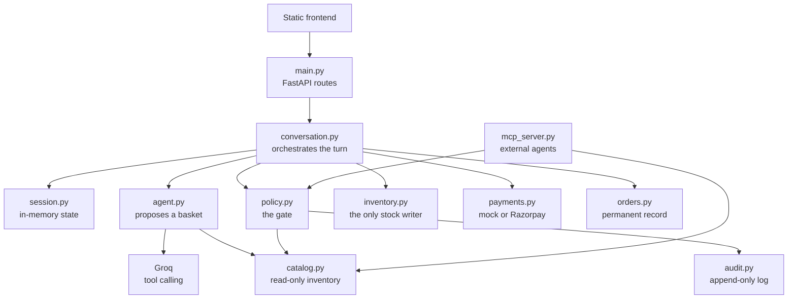
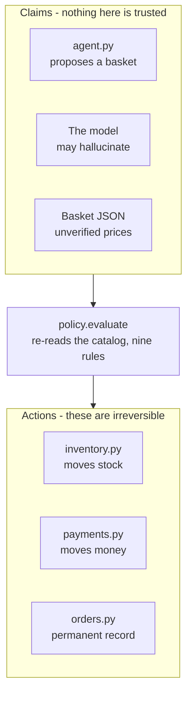
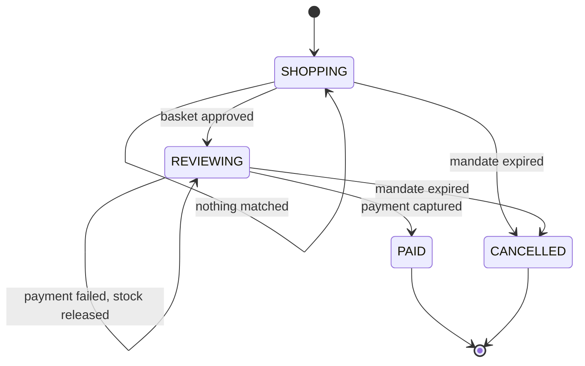
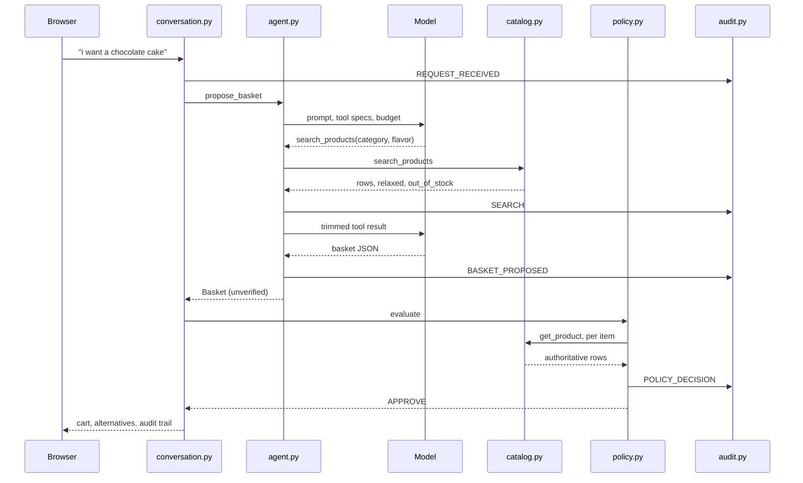
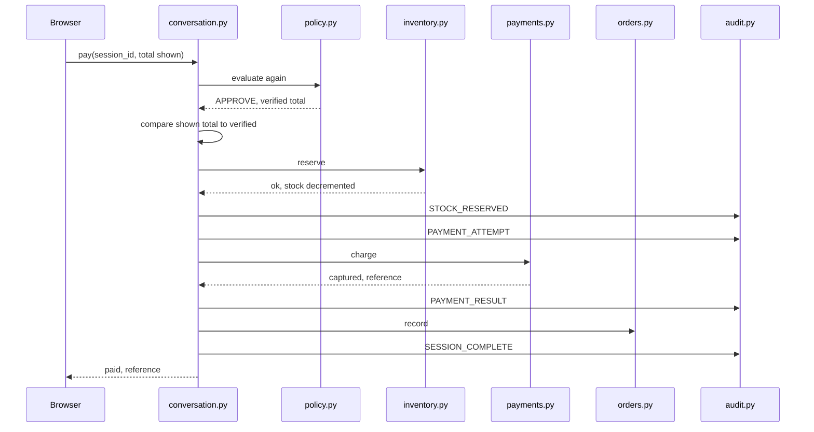
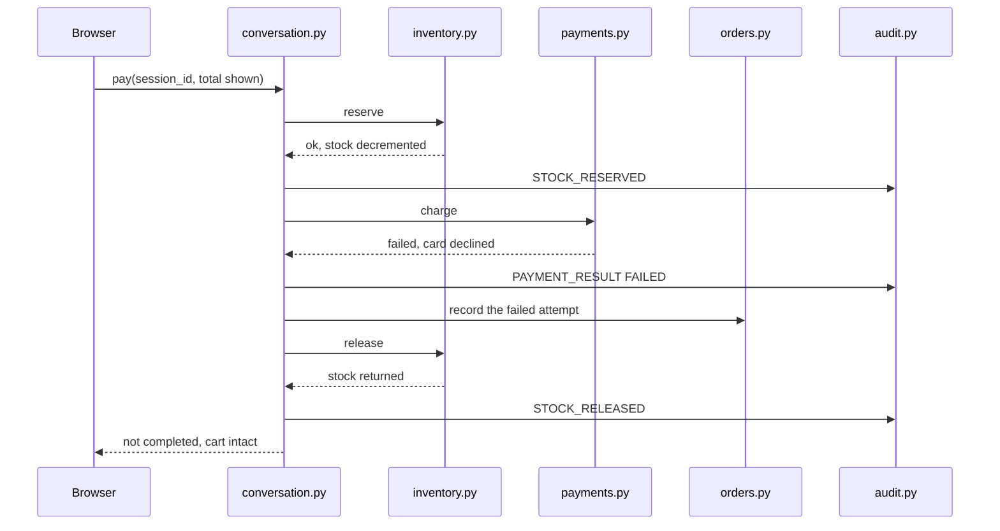
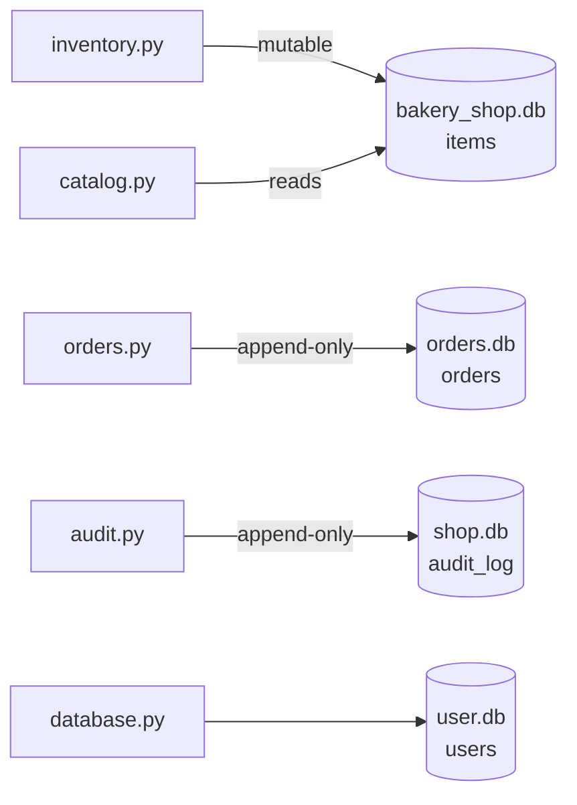
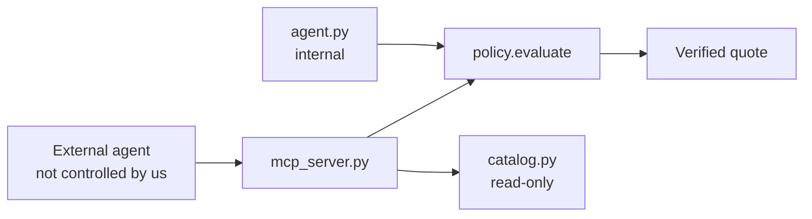

# Agentic Bakery Storefront — Architecture

**Razorpay AI Buildathon · Track 01 — AI growth and agentic commerce**

---

## 1. The problem this project is trying to solve

Think about the last thing you bought online. Just before paying, you
probably checked the total one more time — was the price correct, was
the item actually what you wanted, and was the amount still within what
you were willing to spend?

It is a small step, but it is also the last point where a mistake can be
caught before money moves.

Now imagine removing that step and letting an AI agent handle the
purchase.

An agent can confidently say a cake costs ₹500 when the catalog says
₹550. It can select a product that does not exist, request more units
than are in stock, or build a basket that goes beyond the customer's
authorised budget. The problem is not necessarily that the model is
badly prompted. An LLM generates a proposed action based on what it
believes to be true — and that belief can be wrong.

For a normal chatbot, a wrong answer is usually just a wrong answer. For
an agent connected to inventory and payments, the same mistake can
become an irreversible action.

That is why this project treats the agent's output as a **claim**, not
as the source of truth.

The agent is allowed to search the catalog and propose a basket, but it
does not get to decide whether that basket is valid. Before anything
consequential happens, a deterministic policy layer checks the proposal
against the actual system state.

That leaves three important questions outside the LLM's judgement.

### Who authorised the spending?

Every session has a mandate that defines how much the agent is allowed
to spend. The limit is established before the agent starts making
decisions and is stored outside the agent's control. The agent can
propose products within that limit, but it cannot change the mandate
simply by being asked to.

### What verifies that the proposal is actually correct?

The system does not rely on the model to remember prices, stock levels
or product details correctly. The catalog and inventory are treated as
authoritative. The policy layer re-checks product identity, current
price, quantity, stock availability, budget and the other transaction
constraints before allowing the purchase to proceed.

The model proposes; the system verifies.

### What happens when something goes wrong?

An agent log tells us what the agent attempted to do. That is not
enough. The system also records the authorisation and the policy
decisions around the transaction — what the agent proposed, what was
verified, which checks passed or failed, and what ultimately happened to
the payment.

That gives the merchant a traceable record of the decision, rather than
simply a history of model messages.

### Why a bakery

The demo is a bakery because it makes the idea easy to understand: you
can ask for a cake in a normal sentence and let the agent search the
catalog and build a basket.

But the bakery is not really the point. The interesting part is the
boundary between what an AI agent proposes and what the system is
actually willing to allow.

The LLM handles the flexible part — understanding language, searching,
making suggestions. The deterministic parts handle the consequences —
authorisation, validation, inventory, payment state and auditability.

That separation is the core of the project.

---

## 3. Module map



| Module | What it is responsible for | What it writes to |
|---|---|---|
| `main.py` | HTTP routes and request models | — |
| `conversation.py` | One message in, one reply out | session state |
| `session.py` | Session objects and their states | memory |
| `agent.py` | Turning language into a proposed basket | — |
| `catalog.py` | Inventory search and enum generation | — |
| `policy.py` | Verifying every basket | audit log |
| `inventory.py` | Reserving and releasing stock | `bakery_shop.db` |
| `payments.py` | Talking to a payment provider | — |
| `orders.py` | One row per payment attempt | `orders.db` |
| `audit.py` | The append-only decision log | `shop.db` |
| `mcp_server.py` | Exposing the shop to outside agents | — |
| `model.py` | `Basket`, `BasketItem`, `Mandate` | — |
| `database.py` | User accounts | `user.db` |

Every HTTP request goes through `conversation.py`. The other modules do
not call each other — `agent.py` does not know `policy.py` exists, and
`inventory.py` does not know about `payments.py`. All the coordination
happens in one place, which means the whole business flow can be read in
a single file.

---

## 4. The trust boundary

This is the decision everything else hangs off, so it is worth spending
a moment on.



Above the line, everything is a claim. The model said "chocolate truffle
cake, five fifty, two units" and that is all we know. Below the line,
things become permanent — stock moves, money moves, a record is written.

In between sits the gate, which re-reads the catalog and checks the
claim against it.

What makes this hold in practice is what `agent.py` does not import. It
has no reference to `policy.py`, `inventory.py` or `payments.py`. Python
would not stop someone from changing that later, but keeping the
dependency boundary visible makes the architecture much easier to
review, and it means the agent has no direct path to stock or money even
if the model behind it produces a completely wrong decision.

There is a cost to this and it is worth naming: every price is read from
the database twice. Once so the agent can put a basket together, and
once so the gate can verify it. That duplication is deliberate. Removing
it would mean trusting the agent's copy, which is exactly what this
design refuses to do.

---

## 5. Session state machine



Four states, all defined in `session.py`.

The self-transitions carry most of the interesting behaviour. A blocked
change, a cleared cart and a failed payment all leave the session in
`REVIEWING` — but each of them does something different, and each one is
logged separately.

`PAID` is terminal. A second pay request on an already-paid session is
refused before any provider is contacted. `CANCELLED` is reachable from
either working state and is checked at the top of every single turn, so
an expired mandate cannot be worked around simply by continuing an open
conversation.

---

## 6. What happens when someone adds to their cart



Three details in there are easy to skim past.

The model calls `search_products` itself, rather than the code guessing
what to search for. The loop in `agent.py` allows up to three rounds, so
if someone asks for two different things they get two separate searches
instead of one blurred query that matches neither properly.

Tool results are trimmed before they go back to the model — nine fields,
not the whole row. Product descriptions are long and the model does not
need them to pick an item. This cut the tokens per request by about two
thirds, which mattered once rate limits started biting.

And `policy.py` calls `catalog.get_product()` again for every item, even
though `agent.py` read the same rows a second earlier. That is not a
redundant query. That is the verification.

---

## 7. What happens when a payment succeeds



The gate runs a second time here, and it is worth being clear about why.
The basket was already approved when it was built, possibly a minute
ago. But stock and prices can change in between. Nothing is trusted
twice — including this system's own earlier decision.

The browser also sends back the total it was displaying, and that number
is compared against what the shop just computed. If they no longer
match, the payment stops before anything is reserved. A customer should
never end up confirming one amount while the system charges another.

---

## 8. What happens when a payment fails



Stock is reserved before the charge, never after. This is the ordering
worth defending hardest.

If the system charged first and reserved afterwards, another session
could buy the last cake in between those two operations. That creates a
much worse failure: the customer paid, but the product is no longer
available. With the current flow, the worst normal failure is "payment
didn't go through, so the reservation can be released", which is easy to
recover from.

The failed attempt is still written to `orders.db`. A dispute asks what
was attempted, not only what succeeded.

The session stays in `REVIEWING` with the cart intact, so retrying is a
single click.

**To reproduce this:** set `FORCE_PAYMENT_FAILURE=1` in `.env`. The mock
provider re-reads the file on every charge, so no restart is needed.

---

## 9. Payment has three outcomes, not two

| Status | Meaning | Stock | Session becomes |
|---|---|---|---|
| `captured` | Money moved | Stays reserved | `PAID` |
| `initiated` | Razorpay order created, checkout not completed | Released | stays `REVIEWING` |
| `failed` | Declined, or a provider error | Released | stays `REVIEWING` |

The important distinction is between **creating a Razorpay order** and
**actually receiving a payment**. `order.create` creates the order, but
it does not mean the customer has paid.

The live Razorpay flow in this project stops at order creation. Treating
that step as a successful payment would have made a nicer demo, but it
would put information in the audit log that isn't actually true — which
is exactly the kind of mistake this project is designed to avoid.

Providers live in a dictionary and are chosen by an environment
variable:

```python
PROVIDERS = {"mock": _mock, "razorpay": _razorpay}
```

Adding another provider is one function and one entry.

---

## 10. The gate

`policy.RULES` contains nine independent rule functions. Each one
receives the basket, the mandate and the relevant catalog rows, and
returns a list of reasons why the basket fails that rule. An empty list
means the rule passed.

`evaluate()` runs all nine and collects their failures instead of
stopping at the first one. This is deliberate. If a basket has three
problems, the customer should see all three at once instead of fixing
one problem, sending another request, discovering the second problem,
fixing that, and then discovering the third.

| Rule | Blocks when |
|---|---|
| `_mandate_valid` | The authorisation has expired |
| `_basket_not_empty` | There is nothing to pay for |
| `_no_duplicates` | The same product appears more than once |
| `_products_exist` | A product ID is not present in the catalog |
| `_prices_match` | The claimed price differs from the real price by more than ₹0.01 |
| `_quantities_sane` | Quantity is below 1 |
| `_stock_sufficient` | Requested quantity exceeds available stock |
| `_within_total_budget` | Basket total exceeds the mandate budget |
| `_velocity_ok` | Three or more orders were captured in the last ten minutes |

Because they are independent, adding a tenth rule means writing one
function and appending it to the list. Nobody has to understand the
other nine first.

Three of them are worth explaining, because they look either trivial or
unnecessary until you consider what they catch.

**`_no_duplicates`** might look cosmetic. Why should it matter if the
same cake appears twice in a basket? Because the basket is assembled by
an agent, not a person, and stock is checked one line at a time. If
there are three cakes left and the agent produces two lines of two units
each, both lines pass the stock check individually while the basket as a
whole needs four. That shortfall would only surface inside
`inventory.reserve()`, in the middle of the payment — the worst possible
moment to find it.

**`_products_exist`** is the anti-hallucination rule, and it protects
the others too. `_prices_match` and `_stock_sufficient` both skip items
they cannot find in the catalog, so without this rule an invented
product would slip past every price and stock check and only fail at
reservation time.

**`_velocity_ok`** is the only rule that reads the audit log instead of
the basket. Every other rule asks "is this basket valid?" This one asks
"is this customer placing orders at a reasonable rate?" A runaway agent
produces orders that are each individually perfect — real products,
correct prices, sufficient stock, within budget — so no amount of
per-basket checking will catch it. Only the pattern across orders will.

One implementation note on `_prices_match`: it compares against
`final_price`, the discounted price, which is computed in exactly one
place and read by both the agent and the gate. When discounts were
added, forgetting this in one of those two places broke every discounted
basket. That story is in section 15.

---

## 11. The mandate

Set when a session opens, fixed for its lifetime:

```python
@dataclass
class Mandate:
    mandate_id: str
    customer_id: str
    expires_at: datetime
    total_budget: float
```

The agent is told the budget and how much of it is already committed, so
it rarely proposes something over the limit in the first place. The gate
enforces it, so it cannot succeed if it tries.

There is no override. A basket over budget is not added, and if one
somehow reaches checkout the gate stops it before any stock is held or
any provider is called. Raising a budget means starting a new session
with a new mandate — which is deliberate, because a limit that can be
raised mid-conversation is a suggestion, not an authorisation. Every
order row stores the `mandate_id` it was placed under.

Right now a human confirms every purchase, so the budget is
belt-and-braces. The mandate exists for the case this architecture is
built toward: an agent buying without a person reading each basket.
Then it is the only record of what was authorised.

---

## 12. Data model



Four stores, split by how they change.

`bakery_shop.db` is the only mutable one. `load_items.py` rebuilds it
from `items.csv` with a full table replace, so anything else living
there would be destroyed every time the catalog reloaded. That is the
whole reason orders and the audit log are separate files rather than
extra tables in the same database.

`orders` and `audit_log` are append-only by construction — neither
module exposes an update or a delete. An audit trail that can be edited
afterwards would not be much use for auditing.

**`orders` columns:** `id`, `created_at`, `customer_id`, `session_id`,
`mandate_id`, `status`, `provider`, `reference`, `amount`, `saved`,
`item_count`, `items` (JSON), `message`.

**`audit_log` event types:** `CONVERSATION_START`, `REQUEST_RECEIVED`,
`SEARCH`, `BASKET_PROPOSED`, `POLICY_DECISION`, `STOCK_RESERVED`,
`PAYMENT_ATTEMPT`, `PAYMENT_RESULT`, `STOCK_RELEASED`,
`SESSION_COMPLETE`, `AGENT_ERROR`.

Reading one session's `audit_log` rows in order reproduces the entire
decision path — what was asked, what was searched, what the model
proposed, what the gate decided, and what happened to the stock and the
money.

---

## 13. Search, and the promises it makes

The agent searches through a tool with seven optional filters:
`category`, `flavor`, `occasion`, `taste`, `max_price`, `on_sale` and
`query`.

**The filter values come from the database.** `catalog.enum_values()`
reads the distinct values at import and the tool schema is built from
them, splitting compound cells so `Chocolate & Cherry` yields both tags.
With a free-text field the model could search for a flavour this shop
has never sold, get nothing back, and tell the customer the shop is
empty. An enum makes the impossible request visible to the model before
it is made — and generating it from the database means adding a new
flavour to the catalog needs no code change at all.

**The price ceiling is the remaining budget.** `_capped_price()` caps
`max_price` at what is left of the mandate, so the model never even sees
an item it could not afford. On a modification the ceiling allows for
the largest item in the basket being swapped out, otherwise "replace
this cake with a cheaper one" would come back empty.

**Relaxation is disclosed, never silent.** When a filter combination
matches nothing, the weakest filter is dropped and the search retried,
in this order:

```python
RELAX_ORDER = ["taste", "occasion", "flavor", "query"]
```

The dropped filters go back to the model, which is required to tell the
customer which one it had to let go of. Substituting silently is worse
than returning nothing.

**Two filters are never relaxed.** `category` and `max_price` are absent
from that list on purpose. Offering a brownie to someone who asked for a
cake, or a ₹900 cake to someone who said ₹500, is not a relaxation. It
is a wrong answer.

**Sold out is not the same as does not exist.** When relaxation happens,
the original filters are run again without the stock condition. Anything
that matched but has none left is named to the model, which reports it
by name and offers alternatives rather than quietly substituting one.
Those are two different answers for the customer, and only one of them
means come back tomorrow.

---

## 14. MCP: opening the shop to other agents

Everything so far describes one buyer — the agent running inside this
application. Agentic commerce becomes more interesting in the other
direction: a merchant exposes its shop so that any buyer's agent can
transact with it.



Three tools are published:

| Tool | What it does | Writes |
|---|---|---|
| `search_products` | Live inventory search, same filters and relaxation as the internal agent | no |
| `get_product` | One product by id, with current price and stock | no |
| `quote_basket` | Prices a proposed basket through the real gate | no |

`quote_basket` is the one that makes the argument. An external agent
sends product ids and quantities. The server ignores any price the
caller supplies, reads the real price from the catalog, builds a
`Mandate`, and calls the same `policy.evaluate()` the internal flow
uses. It returns whether the basket is approved, the total the shop
computed, and a reason for every rule that failed.

So an agent written by somebody else, which does not follow this
project's prompt, hits exactly the checks the internal one does:

```
hallucinated product  ->  'unknown' is not a product this shop sells.
99 of a 6-stock item  ->  Only 6 of Black Forest Cake left in stock.
over the budget       ->  Rs1000.00 is Rs500.00 over your Rs500.00 budget.
```

This works precisely because of where the boundary was drawn in section
4. The gate was never inside the agent, so swapping the agent for one
written by somebody else changes nothing about what is enforced. That is
the payoff of the whole design, and MCP is what makes it visible rather
than something merely claimed.

**What is deliberately not exposed.** None of these tools reserve stock
or charge a card. `quote_basket` returns a price, not a hold. Committing
to a purchase still requires an authenticated session and a mandate
issued to a known customer, which stays behind `conversation.py`.
Publishing a write tool would hand an anonymous caller the ability to
move real stock, and no amount of gate would make that acceptable.

---

## 15. Problems faced during development, and their resolutions

These are the bugs that changed how the design works, rather than the
ones that were just typos.

**Adding discounts broke every discounted basket.** After adding a
`discount` column, the gate immediately started rejecting baskets that
were completely correct. The agent was doing the right thing — sending
the discounted price — but the gate was still comparing against the
original. Both sides were computing the payable price, and only one had
been updated. The fix was to make `catalog.final_price()` the only place
that calculation happens, with both sides reading it. *A derived value
computed in two places will drift apart, and you find out at the worst
time.*

**"What's on discount" was filling the cart.** Asking a question and
placing an order looked identical to the system, because the agent could
only ever return baskets. It had no way to say "the customer is just
asking". The fix was an `intent` field with two values, `basket` and
`browse`. *If an agent has no way to express what it means, it will
express the closest thing it can, and that will be wrong.*

**A stamped field made every change look like a change.** Baskets were
compared with `updated.items == previous.items` to work out whether
anything had actually changed. The previous basket had `list_price`
written onto it by the gate; a freshly parsed one did not. So the
comparison always failed. The model was correctly refusing an
over-budget addition and explaining exactly why, but the customer saw
"Updated. Your cart:" instead of the reason. The fix was comparing only
what the customer actually chose — product, quantity, price. *Derived
state does not belong in an identity comparison.* Two tests cover it
now.

**A guard blocked the thing it was meant to allow.** Any empty basket
coming back from a modification was discarded, on the assumption that
the model had failed. It also discarded "empty the cart", which is a
perfectly reasonable request. The fix was a precise check: if the model
sent items and every one failed to parse, that is a failure and it
retries; if it sent an empty list, that is deliberate and it is
honoured. *A guard that cannot tell intent from failure will block
both.*

**The prompt itself was the bug.** The JSON template given to the model
read `{"intent": "browse" or "basket", ...}`, meaning "one of these
two". The model sometimes copied it literally, producing JSON that would
not parse. The fix was a concrete example value, with the allowed values
moved into the written rules. *A prompt is an interface, and ambiguity
in an interface is a bug in it.*

**An argument was threaded through one call site and not the other.**
When the search ceiling became budget-aware, `spent` was passed through
`modify_basket` but the edit to `propose_basket` silently failed to
apply. Every first message crashed. *A test that exercises both entry
points would have caught it, so one was written.*

**A rule was silently doing nothing.** `_velocity_ok` counts recent
captured payments from the audit log, but the query was still looking
for the old `SUCCESS` status while payments had moved to `captured`. The
count was always zero, so the rule always passed. Nothing appeared
broken — it simply never protected anything. *When two modules agree on
a string, changing it in one place fails quietly.*

---

## 16. Testing

41 tests, none of which touch the network or the live database. The
catalog and audit modules are stubbed, so a test never fails because a
cake was bought five minutes earlier, and never writes rows into the
real audit log.

| File | What it covers |
|---|---|
| `test_policy.py` | Every rule in `RULES`, both when it passes and when it should block |
| `test_pricing.py` | Discounted price accepted, original price rejected, savings read from the catalog |
| `test_agent_parsing.py` | Valid, fenced and malformed model output; the budget ceiling on both entry points |
| `test_flow.py` | Capture, failure rollback, `initiated` not treated as paid, stale total, double payment, clearing the cart |

```
pytest
41 passed
```

The most important tests are the ones that verify the system **refuses**
to do something — that a blocked basket never reaches the gateway, that
a stale total is never charged, and that a failed payment gives back the
stock it was holding. Those behaviours are central to the design, and
they are also the easiest things to accidentally break when changing the
code later.

---

## 17. Extending it

| To add | What changes |
|---|---|
| A safety rule | one function appended to `policy.RULES` |
| A payment provider | one function and one entry in `payments.PROVIDERS` |
| A model provider | one function and one entry in `agent.PROVIDERS` |
| An MCP tool | one decorated function in `mcp_server.py` |
| A search filter | a clause in `catalog._build`, a parameter in the tool spec, and its name in `RELAX_ORDER` if it should be droppable |
| A product attribute | a column in `items.csv`; the enums regenerate on restart |

Nothing in that table requires touching more than two files.

---

## 18. Known limitations

This is a buildathon project, not a production payment system. These are
the main gaps, stated rather than left to be found.

**Sessions live in memory.** Restarting the application clears carts,
and the current implementation assumes a single worker process. For a
production deployment, session state would need to move to a persistent
or shared store. The design keeps that responsibility inside one module,
so replacing it would not require changing the policy layer.

**The Razorpay flow stops at order creation.** The checkout handoff is
not implemented, so a live payment is reported as `initiated` rather
than `captured`. The mock provider is used to demonstrate the complete
flow, including successful payment and rollback after failure.

**Enums and tool specifications are built at import time.** If the
catalog is edited while the server is already running, the server needs
a restart before the agent sees the new values.

**A crash can leave stock reserved.** If the process crashes after
reserving stock but before releasing it, that reservation remains in
place. At this scale it can be fixed manually. A production system would
need a reservation timeout or a background cleanup mechanism.

**Intent classification still depends on the model.** The model decides
whether a message is a browsing request or one that should modify the
basket. Occasionally a browsing request could be read as a basket
request. The policy layer limits the damage that can cause, but it
cannot prevent the misunderstanding itself.

**Passwords are stored as plain text.** Intentionally out of scope for
this implementation, and wrong anywhere else.

---

## 19. Running it

```bash
pip install -r requirements.txt
cp .env.example .env          # add GROQ_API_KEY
python src/load_items.py
pytest
uvicorn main:app --reload --app-dir src
```

Then open `http://127.0.0.1:8000`, register an account, and log in — the
session and its mandate are created at login.

`python src/load_items.py` reloads the catalog and resets stock.
`python src/mcp_server.py` runs the MCP server over stdio.

| Variable | Purpose |
|---|---|
| `GROQ_API_KEY`, `GROQ_MODEL` | Groq credentials and a tool-calling model |
| `PAYMENT_PROVIDER` | `mock` or `razorpay` |
| `RAZORPAY_KEY_ID`, `RAZORPAY_KEY_SECRET` | Razorpay test keys |
| `FORCE_PAYMENT_FAILURE` | `1` to demonstrate the rollback |
| `DEFAULT_TOTAL_BUDGET` | mandate budget when none is given |

---

## 20. Against the track brief

> Every money action explainable, bounded and gated. Show the audit
> trail and one failure handled gracefully.

**Explainable** is `audit.py`. Every search, proposal, decision, stock
movement and payment result is written in order, append-only, and shown
live in the interface. Section 12 lists the event types; one session's
rows reproduce the whole decision path.

**Bounded** is the `Mandate`. A budget and an expiry, fixed before
shopping starts and enforced with no override. Section 11.

**Gated** is `policy.evaluate()`. Nine rules, re-run before every basket
change and again before payment. The agent cannot reach stock or money
without passing them. Sections 4 and 10.

**One failure handled gracefully** — the payment declines, the reserved
stock is released, the failed attempt is written to `orders.db`, and the
cart survives so the customer can retry. Section 8.